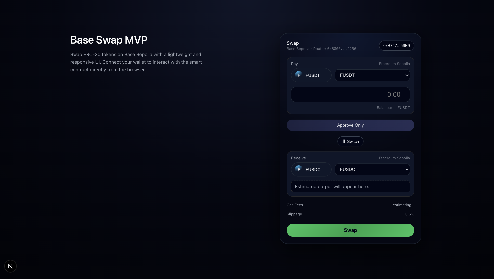

# Swap DApp MVP – Ethereum Sepolia Testnet

A minimal on‑chain token swap application running on ETH Sepolia.
This MVP demonstrates a functional ERC‑20 swap using a simple swap smart contract and web frontend interaction.

### UI Preview

<p align="center">
  
</p>

---

## Features

- Select input & output tokens (FUSDT → FUSDC or reverse)
- Execute real swap transaction on ETH Sepolia
- Connect wallet via wagmi + viem
- Get live transaction status in UI
- Uses deployed FakeUSDT / FakeUSDC contracts

No backend server is required — all interactions happen via smart contract RPC calls.

---

## Architecture & Directory Layout

```
base-swap-mvp/
├── contracts/ # Solidity smart contracts
│ ├── FakeUSDC.sol
│ ├── FakeUSDT.sol
│ ├── TokenSwap.sol
│ └── test/
│
├── scripts/ # Deployment & token utilities
│ ├── deploy_tokens.js
│ ├── deploy_swap.js
│ ├── mint_tokens.js
│ └── fundLiquidity.js
│
├── frontend/ # Next.js UI frontend
│ ├── abi/
│ ├── components/
│ ├── lib/
│ ├── pages/
│ ├── public/
│ │ ├── screenshots/
│ │ │ └── swap-ui.png
│ ├── styles/
│ ├── package.json
│ └── tsconfig.json
│
├── hardhat.config.ts
├── README.md
├── package.json
└── tsconfig.json
```

---

## Technology Versions

### Smart Contract

```
Solidity: ^0.8.20
Hardhat: ^2.22.2
typechain: ^8.x
openzeppelin/contracts: ^5.x
node: >=18
```

### Frontend

```
Next.js: ^14
React: ^18
wagmi: ^2.x
viem: ^2.x
TypeScript: ^5.x
```

---

# Setup Instructions (Full Guide)

## 1. Clone Repository

```bash
git clone https://github.com/Encode-EVM-Bootcamp-Team3/base-swap-mvp.git
cd base-swap-mvp
```

---

# PRIVATE KEY WARNING

Team members DO NOT need private key except the main deployer.

Only ONE person (project owner) should have:

```
PRIVATE_KEY=xxxxxxxxxxxx
```

All other teammates only need public env variables.

---

# Environment Variables

### Deployment side (.env — NOT COMMITTED)

```
PRIVATE_KEY=xxx
ETH_SEPOLIA_RPC_URL=https://eth-sepolia.g.alchemy.com/v2/<your-key>
```

### Frontend side (.env.local — allowed for teammates)

```
NEXT_PUBLIC_SEPOLIA_RPC_URL=https://eth-sepolia.g.alchemy.com/v2/hrOT4tHWSRwNB5mHC6CDf
NEXT_PUBLIC_FAKE_USDT_ADDRESS=0x58d1fB5788283Bc6abb12cF958f56ABAAAf6CC7C
NEXT_PUBLIC_FAKE_USDC_ADDRESS=0x51e78127EA289f36E39d6685bd7e59468814c813
NEXT_PUBLIC_TOKEN_SWAP_ADDRESS=0xB80609D89eFE4b3e1A0Ab91d6c16BB520B762256
```

---

# Deployment Steps (only for deployer)

## Step 1 — Install dependencies

```
npm install
```

## Step 2 — Deploy Fake Tokens

```bash
npx hardhat run scripts/deploy_tokens.js --network sepolia
```

the script outputs:

```
FakeUSDT deployed at: 0x...
FakeUSDC deployed at: 0x...
```

## Step 3 — Deploy TokenSwap

```bash
npx hardhat run scripts/deploy_swap.js --network sepolia
```

## Step 4 — Mint tokens

```bash
npx hardhat run scripts/mint_tokens.js --network sepolia
```

## Step 5 — Provide liquidity

```bash
npx hardhat run scripts/fundLiquidity.js --network sepolia
```

---

# Run Frontend

```bash
cd frontend
npm install
npm run dev
```

Navigate to:

```
http://localhost:3000
```

---

# Using The App

1. connect Rabby / MetaMask
2. switch network → Ethereum Sepolia
3. choose token pair: FUSDT or FUSDC
4. enter amount
5. approve (first time only)
6. swap
7. see tx on Etherscan

---

# Testing

```bash
npx hardhat test
```

---

# Success Criteria

- Swap executes correctly on ETH Sepolia
- Transactions visible on etherscan
- Frontend shows transaction status
- No backend used

---

# Notes for Contributors

- Changes to contracts require redeploy
- After redeploy, update:

  - NEXT_PUBLIC_TOKEN_SWAP_ADDRESS
  - ABI files

- Frontend interacts only through wagmi + viem

---

# License

For educational / bootcamp learning purposes only.
